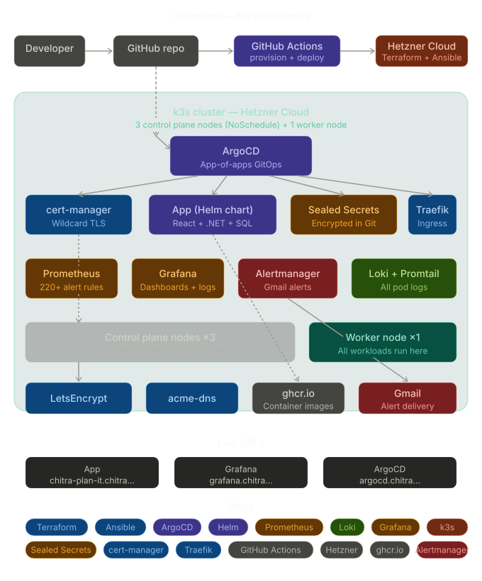
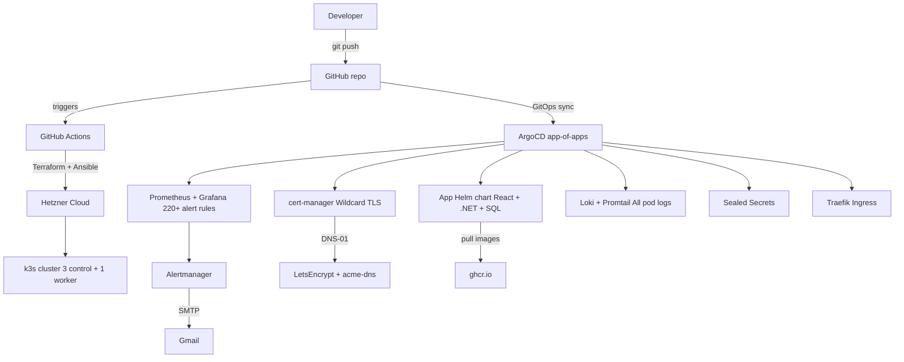

# CB Project — DevOps 

A production-grade DevOps platform built from scratch for the Chas Academy DevOps exam. Everything is automated — provision a fresh cluster, deploy all apps, configure monitoring, logging, and alerts with a single GitHub Actions workflow run.

---

## Architecture diagram

---

## Live URLs

| Service | URL |
|---|---|
| Application | https://chitra-plan-it.chitra.doe24.chas-lab.dev |
| Grafana | https://grafana.chitra.doe24.chas-lab.dev |
| ArgoCD | https://argocd.chitra.doe24.chas-lab.dev |

---

## Architecture

### Cluster
- 3 control plane nodes on Hetzner Cloud with `NoSchedule` taint (no workloads run on control plane)
- 1 worker node — all workloads scheduled here
- k3s v1.33 — lightweight Kubernetes

### Infrastructure as Code
- **Terraform** — provisions Hetzner servers, SSH keys, firewall rules
- **Ansible** — installs and configures k3s on all nodes, joins worker to cluster
- Worker node IP accepted as `workflow_dispatch` input — never hardcoded

### GitOps
- **ArgoCD** with app-of-apps pattern — all Kubernetes resources managed from Git
- Auto sync + self-heal + prune enabled on all apps
- Zero manual `kubectl apply` — everything flows from Git

### App (Individual part)
- Custom **Helm chart** — packages frontend (React), backend (.NET 8), database (SQL Server)
- 8+ customizable values in `values.yaml`
- Images hosted on `ghcr.io` (public)
- Deployed via ArgoCD, triggered by GitHub Actions on push

### Ingress + TLS
- **Traefik** as ingress controller (built into k3s)
- **cert-manager** with LetsEncrypt wildcard certificate via DNS-01 challenge (acme-dns)
- All services accessible over HTTPS with valid TLS

### Secrets
- **Sealed Secrets** — all secrets encrypted and stored in Git
- Cluster keypair backed up as GitHub secret — auto-restored on fresh cluster
- No plaintext secrets anywhere in the repo

### Monitoring
- **kube-prometheus-stack** — Prometheus + Grafana + Alertmanager
- 220+ alert rules out of the box
- **Alertmanager** configured with Gmail receiver — alerts delivered via email
- Custom alert rules in `monitoring-helm-chart/templates/alert-rules.yaml`

### Logging
- **Loki** — log storage and querying
- **Promtail** — DaemonSet running on all 4 nodes, collects logs from every pod
- Logs queryable in Grafana Explore with LogQL

---

## Repo structure
cb-project/
├── .github/workflows/
│   ├── provision.yml    ← provisions cluster (Terraform + Ansible)
│   └── deploy.yml       ← triggers ArgoCD sync on push
├── IaC/                 ← Terraform (Hetzner provider)
├── CMT/                 ← Ansible (k3s install + join)
├── docs/                ← architecture diagram
└── k8s/
├── apps/                       ← ArgoCD Application manifests + sealed secrets
├── chitra-plan-it-helm-chart/  ← custom Helm chart (individual part)
├── cert-manager-helm-chart/
├── monitoring-helm-chart/
├── logging-helm-chart/
└── sealed-secrets-helm-chart/
---

## CI/CD workflows

| Workflow | Trigger | What it does |
|---|---|---|
| `provision.yml` | Manual (`workflow_dispatch`) | Terraform → creates servers, Ansible → installs k3s, restores Sealed Secrets keypair, saves kubeconfig |
| `deploy.yml` | Push to `k8s/**` | Syncs ArgoCD app → deploys latest changes |

## Stack

| Category | Tools |
|---|---|
| Infrastructure | Terraform, Hetzner Cloud |
| Configuration | Ansible |
| Container orchestration | k3s, Docker |
| GitOps | ArgoCD (app-of-apps) |
| App packaging | Helm |
| Ingress | Traefik |
| TLS | cert-manager, LetsEncrypt (DNS-01) |
| Monitoring | Prometheus, Grafana, Alertmanager |
| Logging | Loki, Promtail |
| Secrets | Sealed Secrets |
| CI/CD | GitHub Actions |
| Registry | GitHub Container Registry (ghcr.io) |
| Alerts | Gmail via SMTP |

---

## GitHub repos

- Infrastructure + GitOps: https://github.com/ChitRavi-automates/cb-project
- App source code: https://github.com/ChitRavi-automates/plan-it
